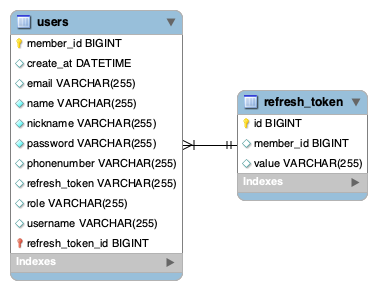

# 회원 기능 프로젝트

## 기능 구현 사항

- [x] 커밋 메시지 컨벤션 설정
- [x] ERD
- [x] API 문서화
- [x] 구현
    - [x] logging
    - [x] 유효성 검사
    - [x] 예외 처리
- [ ] 테스트 코드 작성

# ERD 

# [API 문서화](https://documenter.getpostman.com/view/28697445/2sA3BuV8nd)